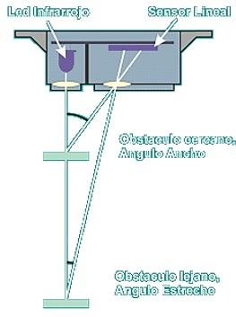

##  Sensor SHARP GP2Y0A21

Un sensor SHARP es un sensor óptico capaz de medir la distancia entre él y un objeto, para esto el sensor con la ayuda de un emisor infrarrojo y un receptor miden la distancia usando triangulación.

El método de triangulación consiste en medir uno de los ángulos que forma el  triángulo emisor-objeto-receptor, el Receptor es un PSD (Position Sensitive Detector) que detecta el punto de incidencia el cual depende del ángulo y a su vez de la distancia del objeto.

La geometría del sensor y de su óptica es el que limita el rango del sensor.

El termino SHARP (Agudo) es porque tiene un rango de visión muy reducido, esto porque la luz que emite es puntual,  lo que permite usar el sensor para escanear o mapear áreas, pero teniendo en cuenta que objetos pequeños serán difíciles de detectar.

También podemos usar varios sensores SAHRP para ampliar el rango de visión estos se pueden poner en diferente dirección e incluso  en la misma dirección siempre y cuando las líneas de visión no queden muy cercanas.

Una ventaja adicional es que no son sensibles a la luz ambiental o el Sol, enemigo de los sensores infrarrojos, un SHARP usa una luz infrarroja intermitente  con una frecuencia determinada, que en el receptor es filtrada y elimina cualquier otra fuente de luz diferente a la frecuencia emitida.
