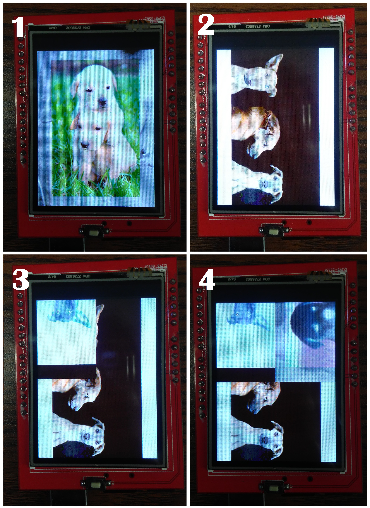

<a name="top"></a>
# Manual de uso para la TFT

## Índice

* [Qué es y cómo funciona](#que_es_y_como_funciona)
* [Precauciones de uso](#precauciones_de_uso)
* [Programación](#programacion)
    * [Gráficos](#graficos)
    * [Touch](#touch)
* [Visualización de imágenes](#sd)
* [Referencias](#referencias)

<a name="que_es_y_como_funciona"></a>
## Qué es y cómo funciona

Para el proyecto trabajaremos con una shield, de manera que sólo montemos el dispositivo sobre el Arduino. Se trata de un pantalla Touch de tipo LCD (liquid crystal display: ‘pantalla de cristal líquido’). Es delgada y plana, formada por un número de píxeles en color o monocromos colocados delante de una fuente de luz o reflectora. Una de sus ventajas es que presenta colores vibrantes, y en general mantiene altos contrastes de color más cercanos a la realidad que otras tecnologías similares. Sin embargo, carece de negros profundos y posee un tiempo de respuesta relativamente lento, lo cual en ocasiones presenta un "efecto fantasma", es decir, permanece el reflejo de una imagen que ya no debería de aparecer.

Las siglas TFT significan "Thin Film Transistor" ó "transistor de película delgada". Se trata de una tecnología basada en transistores de efecto de campo, esto es, se coloca sobre una placa de cristal un electrodo (lamina que conduce electricidad), sobre la cuál se colocan capas delgadas, y al activarse por medio del electrodo cada una, se van activando los colores, formándose de esta forma cada píxel. Actualmente se utilizan apliamente en la industria de control. Es común encontrar este tipo de pantallas en pantallas de computadoras portátiles o colectoras de datos.

Sobre la pantalla hay un panel táctil resistivo de 4 hilos que nos permitirá obtener las coordenadas X e Y donde pulsemos sobre la pantalla. En general, una pantalla táctil resistiva consiste principalmente en dos capas separadas de material plástico conductor con una determinada resistencia a la corriente eléctrica, que al pulsar en un punto determinado de la capa exterior, ésta hace contacto con la capa interior, y midiendo la resistencia calcula el punto exacto donde se ha pulsado en un eje de coordenadas X e Y. Algunos tipos de pantallas resistivas, como la del modelo que usaremos, permiten también la medición de un eje Z, es decir, la presión que se está realizando sobre el punto en concreto de la pantalla.

<a name="sobre_la_shield"></a>
### Sobre la shield

La shield cuenta con 28 pines que encajan perfectamente con cualquier Arduino Uno o Mega. Aunque realmente serán las bibliotecas que usemos quienes se encarguen de los detalles del funcionamiento, se puede hacer la siguiente clasificación sobre los pines, y ver su correspondencia con el Arduino Uno:

* Pines de comando LCD:
    * LCD_RST - A4
    * LCD_CS - A3
    * LCD_RS - A2
    * LCD_WR - A1
    * LCD_RD - A0
* Pines de datos LCD:
    * LCD_D0 - 8
    * LCD_D1 - 9
    * LCD_D2 - 2
    * LCD_D3 - 3
    * LCD_D4 - 4
    * LCD_D5 - 5
    * LCD_D6 - 6
    * LCD_D7 - 7
* Pines de tarjeta SD:
    * SD_SS - 10
    * SD_DI - 11
    * SD_DO - 12
    * SD_SCK - 13
* Pines de alimentaión:
    * GND - GND
    * 5V - 5V
    * 3.3V - 3.3V

Así, para el caso del Arduino Uno, sólo nos quedan libres los pines A5, 0 (Tx), 1 (Rx), Vin, dos GND, AREF, IOREF y RESET.

[Subir](#top)

<a name="precauciones_de_uso"></a>
## Precauciones de uso

* **Limpieza.** La manera recomendada para la limpieza de pantallas TFT es simplemente humedecer con agua corriente un paño limpio, suave y sin hilos, y frotar suavemente la pantalla evitando rociarla, ya que esto puede causar que el líquido se introduzca por los bordes de la pantalla y dañar el equipo. Aunque en general debería de bastar con un trapo limpio y seco para limpiar el polvo y la grasa de los dedos. Por esto último, es recomendable usar un lápiz táctil en lugar de los dedos de las manos.
* **Montar y desmontar.** En general es un dispositivo delicado, y no cuenta con un soporte muy rígido, por lo cual hay que evitar presionarla demasiado fuerte por la parte central. Para colocarla en el arduino se debe sobre poner, revisando que coincidan adecuadamente los pines (revisar [correspondencia de pines](#sobre_la_shield)), y posteriormente hacer presión sobre los costados donde se encuentran los pines, ambos lados al mismo tiempo. Para retirarla se puede tomar el arduino con una mano y con la otra las cuatro esquinas de la shield, jalando todas al mismo tiempo, sin presionar nunca en el centro.

[Subir](#top)

<a name="programacion"></a>
## Programación en Arduino

Existen diferentes bibliotecas dedicadas al uso de la TFT LCD Shield. Y dependiendo de modelo que tengamos de ésta, puede convenir usar una u otra. Para nuestro caso usaremos las siguientes:

```C++
#include <SPFD5408_Adafruit_GFX.h>     // Para los gráficos
#include <SPFD5408_Adafruit_TFTLCD.h>  // Específica del hardware
#include <SPFD5408_TouchScreen.h>      //Para acciones del touch
```

Descargar: [biblioteca SPFD5408](https://github.com/JoaoLopesF/SPFD5408)    
Es una modificación de la biblioteca de Adafruit

Luego definimos los pines de la LCD. Asignamos los valores predeterminados. Usaremos estas definiciones para iniciar la comunicación con la pantalla

```C++
#define YP A1
#define XM A2
#define YM 7
#define XP 6
#define LCD_RESET A4
#define LCD_CS A3
#define LCD_CD A2
#define LCD_WR A1
#define LCD_RD A0

//Iniciamos la comunicación
Adafruit_TFTLCD tft(LCD_CS, LCD_CD, LCD_WR, LCD_RD, LCD_RESET);
```

Para comenzar el programa, hay dos métodos importantes que debemos usar, los cuales pondremos en el setup del código. Primero reseteamos la tft mediante reset(). Después debemos indicar, mediante un ID, con qué driver está trabajando nuestra TFT, ya que como se indicó antes existen diferentes modelos. Para nuestro caso se usa el ILI9341 240x320, cuyo ID es 0x9341

```C++
void setup() {
  
  tft.reset(); //Reseteamos 
  tft.begin(0x9341);

}
```

Otras opciones de controladores son:

```
HX8347-A 240x320 ID = 0x8347
ILI9320 240x320 ID = 0x9320
ILI9325 240x320 ID = 0x9325
ILI9327 240x400 ID = 0x9327
ILI9329 240x320 ID = 0x9329
ILI9335 240x320 ID = 0x9335
ILI9341 240x320 ID = 0x9341
ILI9481 320x480 ID = 0x9481
ILI9486 320x480 ID = 0x9486
ILI9488 320x480 ID = 0x9488
LGDP4535 240x320 ID = 0x4535
RM68090 240x320 ID = 0x6809
R61505V 240x320 ID = 0xB505
R61505W 240x320 ID = 0xC505
R61509V 240x400 ID = 0xB509
S6D0154 240x320 ID = 0x0154
SPFD5408 240x320 ID = 0x5408
SSD1963 800x480 ID = 0x1963
SSD1289 240x320 ID = 0x1289
ST7781 240x320 ID = 0x7783
ST7789V 240x320 ID = 0x7789
```

La pantalla puede tener diferentes rotaciones, las cuales están asociadas con índices: 0 -> vertical, 1 -> horizontal, 2 -> vertical invertida, 3 -> horizontal invertida. Por defecto tenemos el valor de 0, pero podemos modificarlo a lo largo del programa mediante la siguiente función:

```C++
tft.setRotation(indice);
```

Cabe mencionar que esta función no rotará lo que ya se encuentra en la pantalla al momento de usarla, sino que servirá de guía para lo que se dibuje despues de.

<a name="graficos"></a>
### Gráficos

Lo primero que deberíamos de hacer es definir los colores que vamos a usar. Para esto se ocupa un código RGB de 16 bits. Sin embargo el modelo de TFT que estamos usando trabaja con colores complementarios u opuestos. Esto significa que si queremos usar el color blanco, por ejemplo, deberíamos usar el código que corresponde al color negro.
Algunos ejemplos de colores básicos que podemos usar son:

```C++
#define BLANCO       0x0000 //Negro -> Blanco
#define NEGRO        0xFFFF //Blanco -> Negro
#define CYAN         0xF800 //Rojo -> Cyan
#define MAGENTA      0x07E0 //Verde -> Rosa
#define AMARILLO     0x001F //Azul -> Amarillo
#define ROJO         0x07FF //Cyan -> Rojo
#define AZUL         0xFFE0 //Amarillo -> Azul
#define VERDE        0xF81F //Rosa -> Verde 
#define NARANJA      0x03FF //BLUE3 -> NARANJA
#define PURPURA      0x9FE0 // NEOYELLOW -> PURPURA

#define LILA            0x6BC3 //OLIVE -> LILA
#define MENTA           0x8888 //BROWN2 -> VERDE AGUA
#define ROSA            0x05E5 //EMERALD -> ROSA
#define SIENA           0x3333 //ROYALBLUE -> SIENA
#define AZUL_CLARO      0xFC80 //ORANGE -> AZUL CLARO
#define AZUL_PASTEL     0x7083 //BROWN1 -> AZUL_PASTEL
#define VERDE_PISTACHE  0xF811 //SIENNA -> VERDE PISTACHE
#define VERDE_LIMON     0x781F //PURPLE -> VERDE CLARO
#define VERDE_OSCURO    0xFADF //PINK -> VERDE2 UN POCO OSCURO
#define VERDE_ESMERALDA 0xFCDF //DKPINK -> ESMERALDA
```

#### Texto

Por defecto tenemos un *tamaño* 1, que equivale a 7 pixeles de altura; los diferentes tamaños están asociados a números enteros a partir del 1; cada tamaño aumenta 7 pixeles a la altura del texto. *El cursor* posee una coordenada asociada a la esquina superior izquierda del texto por escribir; inicialmente es de (0,0). Y en cuanto al *color*, es negro por default. Podemos cambiar cualquiera de los valores anteriores con las siguientes funciones:

```C++
tft.setCursor(posicionX, posicionY); //Cambiamos la coordenada del cursor
tft.setTextSize(int_tamano); //Cambiamos el tamaño del texto
tft.setTextColor(color); //Cambiamos el color del texto
```

Para mostrar el texto en pantalla tenemos dos opciones:

```C++
tft.print("texto 1");
tft.println("texto con salto de línea al final")
```

Si el texto llega al borde de la pantalla, se cortará y continuará una línea abajo.

#### Figuras

Podemos **dibujar** diferentes elementos de manera muy sencilla, indicando sus coordenadas y el color de la línea.

```C++
//Para dibujar una línea, indicamos las coordenadas donde comienza y donde termina, así como el color
tft.drawLine(X0, Y0, Xf, Yf, color);
//La línea puede ser Vertical u Horizontal, entonces sólo será necesario indicar el punto de partida, la longitud y el color
tft.drawFastVLine(X0, Y0, longitud, color);
tft.drawFastHLine(X0, Y0, longitud, color);
//Para dibujar un círculo indicamos las coordenadas del centro, el radio en pixeles, y el color;
tft.drawCircle(Xcentro, Ycentro, radio, color);
//Para dibujar un rectángulo damos la coordenadas de la esquina superior izquierda, base y altura en pixeles, y color
tft.drawRect(X0, Y0, base, altura, color);
//Podemos hacer un retángulo con esquinas redondeadas agregando el radio de dicha curvatura
tft.drawRoundRect(X0, Y0, base, altura, radioCurva, color);
//Para el caso de triángulo indicamos las cordenadas de sus tres vertices y el color
tft.drawTriangle(X1, Y1, X2, Y2, X3, Y3, color);
```

Si deseamos "**pintar las figuras**", sólo cambiamos *draw* por *fill*

```C++
//Si quisieramos darle color a toda la pantalla podríamos pintar un rectángulo enorme, de 240x320
//Otra ocpión más simple es usar la siguiente función:
tft.fillScreen(color);
//Para dibujar un círculo indicamos las coordenadas del centro, el radio en pixeles, y el color;
tft.fillCircle(Xcentro, Ycentro, radio, color);
//Para dibujar un rectángulo damos la coordenadas de la esquina superior izquierda, base y altura en pixeles, y color
tft.fillRect(X0, Y0, base, altura, color);
//Podemos hacer un retángulo con esquinas redondeadas agregando el radio de dicha curvatura
tft.fillRoundRect(X0, Y0, base, altura, radioCurva, color);
//Para el caso de triángulo indicamos las cordenadas de sus tres vertices y el color
tft.fillTriangle(X1, Y1, X2, Y2, X3, Y3, color);
```

#### Botones

Otra interesante opción es la de **dibujar botones**. En la biblioteca podemos encontrar a la clase *Adafruit_GFX_Button*, que hace más sencillo este proceso.    
Para instanciarlo, el primer argumento es un apuntor a *Adafruit_GFX*, donde le mandaremos la dirección de la *Adafruit_TFTLCD* que instanciamos al inicio del programa, *tft*, como lo hemos estado manejando en el manual. El resto es como dibujar un rectangulo redondeado, sólo que agregamos los colores de fondo y de relieve del botón, el tamaño y el color del texto, y la cadena que será escrita.

Primero lo declaramos, fuera del *setup* y del *loop* para poder ocuparlo en ambas funciones:
```C++
Adafruit_GFX_Button btn1 = Adafruit_GFX_Button();
```

Entonces debemos llamar otros dos métodos antes de poder usar el botón. Uno para inicializarlo y luego otro para dibujarlo

```C++
void initButton(&tft, X0, Y0, base, altura, colorRelieve, colorFondo, colorTexto, "Texto del boton", tamanoTexto);
void drawButton();
```

Es importante considerar el orden en el que mostramos texto o diferentes figuras, ya que todo lo que se mande a la pantalla será sobrepuesto.

<a name="touch"></a>
### Touch

Para poder trabajar con el panel táctil usamos la biblioteca *SPFD5408_TouchScreen.h*. Una vez incluida, lo primero que debemos de hacer para poder leer las pulsaciones es instanciar el panel. Recordemos algunos de las definiciones que hicimos de los pines que vamos a ocupar.

```C++
#define YP A1
#define XM A2
#define YM 7
#define XP 6

//Instanciamos el panel
TouchScreen ts = TouchScreen(XP, YP, XM, YM, 300);
```

El último parámetro del constructor de *TouchScreen* se asocia a la sensibilidad del panel. Entre más preciso sea el valor, mejor detectadas serán las pulsaciones. Puede medirse con ayuda de un multímetro, revisando la resistencia que hay entre XP(el pin digital 6) y XM(el pin analógico 2).

Otras definiciones importantes son los valores de calibración para la lectura de pulsaciones en el panel, ya que lo primero que se nos devolverá serán valores entre 0 y 1023, los cuales debemos asociar a coordenadas en la pantalla, para saber dónde se presionó. Para el caso de nuestra TFT, los valores son los siguientes:

```C++
#define TS_MIN_X 125
#define TS_MIN_Y 85
#define TS_MAX_X 965
#define TS_MAX_Y 905

//Igualmente podemos dar valores mínimo y máximo de presión en z
#define PRESION_MIN 10
#define PRESION_MAX 1000

//Declaramos variables para los valores de coordenada que tendrán las pulsaciones
int X, Y;
```

***Nota:*** estos valores cambian según la rotación de la pantalla; los anteriores corresponden a la de índice 2. Podemos elegir la rotación que deseemos indicándolo en cualquier parte del código sin problema, pero es importante incluir la instrucción `tft.setRotation(2)` justo antes de obtener una pulsación para que funcione de manera correcta, así como regresar a la rotación anterior después para que el programa se comporte de la manera que queremos.

Finalmente debemos de obtener las coordenadas del punto en el que se haga presión sobre el panel de la TFT. Por buenas prácticas, agruparemos el código necesario en una función, la cual devolverá un objeto de la clase TSPoint. 

```C++
TSPoint obtenerPunto() {
  TSPoint p; //Instanciamos un objeto de la clase TSPoint
  
  do {
    p = ts.getPoint(); //Tomamos los valores de coordenadas, que inicialmente erán valores entre 0 y 1023
    //Los pines XM y YP son usados por la biblioteca como pines de salida
    pinMode(XM, OUTPUT);
    pinMode(YP, OUTPUT);
  } while((p.z < PRESION_MIN ) || (p.z > PRESION_MAX)); //Revisamos que los valores de presión se encuentre en el rango

  //Modificaremos los valores de p.x y p.y con un mapeo,
  //considerando nuestros valores de calibración y las dimensiones de la LCD
  p.x = map(p.x, TS_MIN_X, TS_MAX_X, 0, 320);
  p.y = map(p.y, TS_MIN_Y, TS_MAX_Y, 0, 240);
  
  //Finalmente retornamos el punto modificado
  return p;
}
```

Así, en nuetro *loop()* sólo debería de ir lo suiguiente:

```C++
TSPoint p = obtenerPunto();
X = p.y; //Invertimos los valores por el comportamiento que tiene nuestro modelo de TFT
Y = p.x; //para que la lectura se haga de manera correcta. Esto varía de un modelo a otro
```

Al usar `getPoint()` el programa se queda en pausado en espera de una pulsación, lo cuál se verá reflejado en `obtenerPunto()`.

#### Botones

En la parte de gráficos se mencionó la posibilidad de dibujar botones, sin embargo no hay un método incluido en la clase para detectar directamente si se presionó o no. Para esto debemos de revisar si los valores de coordenada* de una pulsación se encuentran dentro del dibujo del botón. De ahí, hay un método para indicarle al botón que fue pulsado, y otro para saber si está presionado. Recordemos la instancia del botón, y pensemos en un ejemplo.

\*Recordemos que debemos hacer dicha consideración de acuerdo a la rotación de índice 2.

```C++
void initButton(&tft, X0, Y0, base, altura, colorRelieve, colorFondo, colorTexto, "Texto del boton", tamanoTexto);
```

```C++
if(X > X0 && X < X0+base && Y > Y0 && Y < Y0+altura){ //Si los valores de coordenada de la pulsación están dentro del botón
  btn1.press(true); //Le indicamos al botón que fue presionado
} else {
  btn1.press(false); //Pensemos que si se toca en cualquier otro lado, el botón deja de estar presionado
}
  
if(btn1.isPressed()){ //isPressed arroja un booleano, según esté o no presionado el botón
  Serial.println("El botón está presionado");
}else{
  Serial.println("El botón no está presionado");
}
```

<a name="sd"></a>
### SD. Visualización de imágenes

En la parte inferior, del lado del botón de reset, la TFT cuenta con una ranura para tarjeta de memoria micro SD. Podemos usarla para almacenar imágenes, las cuales pudrán ser visualizadas en la pantalla. Para esto, debemos de tener ciertas consideraciones:

* Recordemos que el controlador de nuestro modelo representa los colores invertidos, por lo que cualquier imagen que deseemos usar, para verla de manera correcta, debemos almacenar una versión en negativo de la misma.
* *El tamaño sí importa*, y nuestra TFT lo sabe. Nuestro modelo tiene dimensiones de 240x320 pixeles, y si la imagen es de mayor tamaño se verá cortada; si es menor, no llenará todo el espacio, aunque puede que en algunos casos sea lo que queramos.
* Y bueno, el formato debe ser bmp. En internet hay varias páginas para hacer estas conversiones de manera fácil. De cualquier manera, en algunos casos, al intentar mostrar la imágen en pantalla, me marcaba "Formato no reconocido"

En cuanto al código, primero irá un poco de lo que ya hemos usado. Incluiremos dos nuevas bibliotecas y una definicón más

```C++
#include <SPFD5408_Adafruit_GFX.h>     // Para los gráficos
#include <SPFD5408_Adafruit_TFTLCD.h>  // Específica del hardware
#include <SD.h>
#include <SPI.h>

#define LCD_RESET A4
#define LCD_CS A3
#define LCD_CD A2
#define LCD_WR A1
#define LCD_RD A0
#define SD_CS 10

Adafruit_TFTLCD tft(LCD_CS, LCD_CD, LCD_WR, LCD_RD, LCD_RESET);
```

Entonces, en el *setup()* verificaremos la conexión con la tajeta SD; si falla finalizamos el programa. En el *loop()* usaremos `bmpDraw()` para mostrar la imagen, donde indicaremos el nombre, con ruta de ser necesario, y las coordenadas donde será mostrada.

```C++
void setup()
{
  //Usaremos el monitor serial para detectar posibles errores o ver que todo marche bien
  Serial.begin(9600);
  
  //Reseteamos e iniciamos comunicación con la TFT
  tft.reset();
  tft.begin(0x9341);

  Serial.print(F("Iniciando tarjeta SD..."));
  if (!SD.begin(SD_CS)) { //begin instanciará la SD. Si todo sale bien arrojará un true, en otro caso, un false
    Serial.println("Fallido");
    return;
  }
  Serial.println("Completado");
}

void loop()
{
  tft.setRotation(0);
  bmpDraw("1.bmp", 0, 0); //Indicamos el nombre del archivo, y sus coordeanadas x,y
  delay(2000);
  
  tft.setRotation(1);
  bmpDraw("/img/2.bmp", 50, 50); //De esta manera podemos indicar la ruta. Recordar iniciar con /
  delay(2000);
}
```

`bmpDraw()` no está incluida en las bibliotecas que hemos usado, pero la podemos encontrar en uno de los ejemplo que nos ofrece la biblioteca de Adafruit y funciona muy bien. Bastará con incluir dicha fracción del código en nuestro programa. En la carpeta *ProtecoHardware/Uso de Hardware/TFT* podemos encontrar un ejemplo completo del uso de la SD en la TFT. Las imágenes usadas pueden encontrarlas en *ProtecoHardware/Uso de Hardware/TFT/img*, y el resultado debería de ser el siguiente:



El programa hace una secuencia de imágenes que se va repitiendo indefinidamente. Podemos apreciar cómo al visualizar una foto, la anterior no se borra, sólo se sobreponen. Además no giran cuando hacemos una rotación en el código. Recordemos que `tft.setRotation()` sólo sirve para indicar cómo será visualizado el contenido que se indique después. A propósito inlcuyo las imágenes en su color original y en negativo, para hacer la comparación viéndolas en la pantalla de la TFT y en algún otro visor cualquiera.

[Subir](#top)

<a name="referencias"></a>
## Referencias

https://www.ecured.cu/LCD_(pantalla_de_cristal_l%C3%ADquido)#Inconvenientes    
http://www.informaticamoderna.com/Pantalla_TFT.htm#ani    
https://electronicavm.wordpress.com/2015/03/05/tft-lcd-touch-2-4-shield-para-arduino-uno/#more-2209    
https://circuitdigest.com/microcontroller-projects/arduino-touch-screen-calculator-tft-lcd-project-code    
https://github.com/JoaoLopesF/SPFD5408    

[Subir](#top)